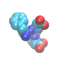
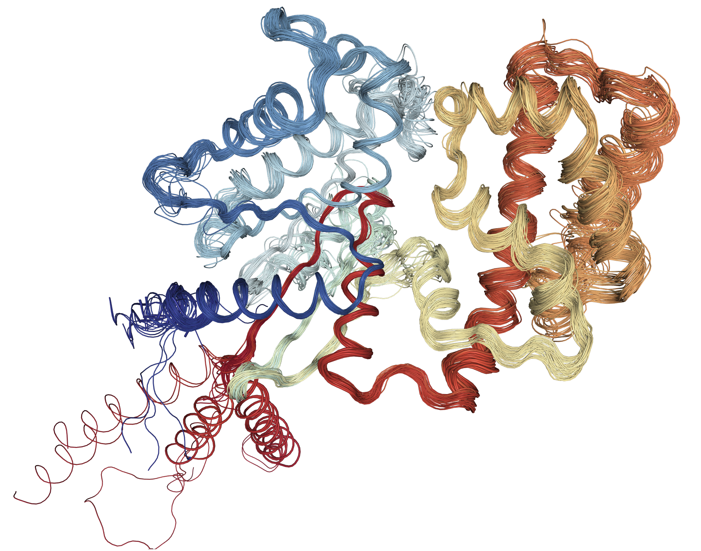

<!-- README.md is generated from README.Rmd. Please edit that file -->

## Bio3DView 

<!-- badges: start -->
<!-- badges: end -->

Interactive biomolecular structure visualization of
[bio3d](http://thegrantlab.org/bio3d/) objects in R.

## Installation

To install the development version of bio3dview from
[GitHub](https://github.com/bioboot/bio3dview), use:

``` r
# install.packages("pak")
pak::pak("bioboot/bio3dview")
```

Dependencies include the R CRAN packages
[bio3d](https://cran.r-project.org/web/packages/bio3d/index.html) and
[NGLVieweR](https://cran.r-project.org/web/packages/NGLVieweR/), which
can be installed with:

``` r
install.packages("bio3d")
install.packages("NGLVieweR")
```

## Example 1: Basic Structure Visualization

First let’s load up the packages and generate a quick NGL (webGL based)
structure overview of a bio3d `pdb` class object with a number of simple
defaults. The returned NGLVieweR object can be further added to for
custom interactive visualizations:

``` r
library(bio3dview)
library(bio3d)
library(NGLVieweR)

pdb <- read.pdb("5p21")
view.pdb(pdb) |>
  setSpin()
```

<figure>

<figcaption aria-hidden="true"><strong>Figure 1</strong>. Structure of
HRas PDB code: 5p21. <em>Note that the image here is not interactive due
to restrictions with GitHub GFM format.</em></figcaption>
</figure>

## Example 2: Visualizing a Multi-Structure Ensemble

Generate an interactive view of a bio3d `pdbs` object containing
multiple structures:

``` r
data(transducin)

view.pdbs(transducin$pdbs, colorScheme = "res") 
```

<figure>

<figcaption aria-hidden="true"><strong>Figure 2.</strong> All 53 PDB
structures of Transducin colored by residue index</figcaption>
</figure>

## Example 3: NMA Visualization

Perform a quick Normal Mode Analysis (NMA) and visualize the predicted
large-scale domain motions:

``` r
adk <- read.pdb("6s36")
m <- nma(adk)
view.nma(m, pdb=adk) |>
  setPlay()
```

<figure>

<figcaption aria-hidden="true"><strong>Figure 3.</strong> Predicted
large scale domain motions of Adenalate kinase from a bio3d based Normal
Mode Analysis.</figcaption>
</figure>

## Going further

Many additional visualization options are available. Check out the
[Getting Started
vignette](https://bioboot.github.io/bio3dview/articles/bio3dview.html)
for more examples, or refer to individual function [help
pages](https://bioboot.github.io/bio3dview/reference/index.html) for
detailed documentation.
