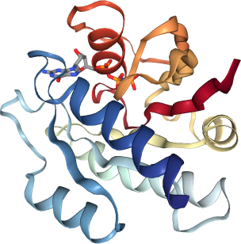

```{r, include = FALSE}
knitr::opts_chunk$set(
  collapse = TRUE,
  comment = "#>",
  fig.align = "center"
)
```

## Overview

[Bio3DView](https://github.com/bioboot/bio3dview) is an R package for biomolecular structure visualization. It is designed to complement the [Bio3D](http://thegrantlab.org/bio3d/) structural analysis package and the [NGLVieweR](https://nvelden.github.io/NGLVieweR/) visualization package.


## Features 

Major features include:

- Sensible and attractive defaults with minimal coding requirements,
- Interactive visualization of biomolecular structures (`pdb` and related objects from Bio3D),
- Visualization of structural ensembles (`pdbs` objects),
- Molecular visualization of Principal Component Analysis results (`pca` objects).
- Interactive rendering of Normal Mode Analysis results (`nma` objects),
- Support for various computed dynamic trajectory data (`xyz` objects).


## Installation

This bio3dview package is not yet on CRAN but can be installed from [GitHub](https://github.com/bioboot/bio3dview) with:

``` r
# install.packages("pak")
pak::pak("bioboot/bio3dview")
```

Dependencies include  [bio3d](https://cran.r-project.org/web/packages/bio3d/index.html) and [NGLVieweR](https://cran.r-project.org/web/packages/NGLVieweR/) packages, which can be installed from CRAN with:

``` r
install.packages("bio3d")
install.packages("NGLVieweR")
```

## Basic usage

Typical usage starts with loading all three companion packages:

```{r setup}
library(bio3dview)
library(bio3d)
library(NGLVieweR)
```

The workflow generally follows these steps:

1.  **Read**, analyze or compute data using **Bio3D** functions.

2.  **View** resulting data with **Bio3DView** functions.

3.  **Add** optional extra customization with **NGLVieweR** functions.


For example, let's begin with reading an online PDB structure of HRas (with PDB code: 5p21 using `bio3d::read.pdb()`. Then generate the default 3D view with `bio3dview::view.pdb()` (rainbow colored protein cartoon with bound nucleotide ligand and ions highlighted in atom colored licorice representation). Finally, set it all spinning with `NGLVieweR::setSpin()`:

```{r overview, warning=FALSE}
ras <- read.pdb("5p21")
view.pdb(ras) |>
  setSpin()
```


## Key functions

All the key functions of this package are all named **`view.<object>()`**, these include:

- `view.pdb()` - for interactive PDB viewing, 
- `view.pdbs()` - for interactive multi-structure PDBS viewing, 
- `view.pca()` - for molecular viewing of bio3d PCA results, 
- `view.nma()` - for molecular viewing of bio3d NMA results, 
- `view.xyz()` - for molecular viewing of bio3d trajectory data. 

Each function returns an NGLVieweR object, ehich can be further customized and added to using NGLVieweR functions such as `setSpin()`, `setRock()`, `addRepresentation()`, `addStructure()`, `setRotation()` etc. Refer to the NGLVieweR documentation for more customization options.


## Single structure models

To obtain a quick interactive molecular visualization of any bio3d `pdb` class object we can use the `view.pdb()` function. If you are young and hip and prefer to use pipes you can obviously do things your way: 

```{r pipe, eval=FALSE}
"5p21" |> 
  read.pdb() |> 
  view.pdb()
```

You can also customize the display in many ways with minimal code. For example, lets color by secondary structure, change the background color and highlight some key residues as spacefill/vdw:

```{r}
view.pdb(ras, backgroundColor = "pink", colorScheme="sse",
         highlight = atom.select(ras, resno=45:48),
         highlight.style="vdw")
```

You can always save the returned object and add to it later, for example

```{r}
v <- view.pdb(ras, water.rm = TRUE)
addRepresentation(v, "ball+stick") |>
  setSpin()
```

## Multi-model data

The `view.pdb()` function also supports multi-model files produced as trajectories from bio3d or obtained from any other source such as NMR structures, for example:

```{r, warning=FALSE}
pdb <- read.pdb("2MPS", multi=TRUE)
view.pdb(pdb) 
```

## Multiple structure ensembles

To view multi-structure `pdbs` objects from bio3d use the `view.pdbs()` function, for example:

```{r pdbs1, warning=FALSE}
data(transducin)
attach(transducin)

view.pdbs(pdbs) |>
  setSpin()
```


## Coloring options

The default, as shown above, is to color each structure individually using VMD colors (as returned from `vmd_colors()`). This coloring can be changed in two main ways, using either your own `cols` vector or by specifying a `colorScheme` NGL keyword arguments.

Valid `colorScheme` keyword options are first checked with the utility function `color_key_match()`. 

Useful `colorScheme` keyword values here include:  

- `"residueindex"`, 
- `"modelindex"`, 
- `"sstruc"`, 
- `"bfactor"`,
- `"chainid"`, 
- `"chainindex"`, 
- `"atomindex"`, 
- `"occupancy"`, 
- `"hydrophobicity"`, 
- `"element"` 

and the various adaptions of these names in common use elsewhere in bio3d. These include `"sse"` for secondary structure, `"b"` for B-factor, `"resno"` for residue number, `"resid"` for residue identifier/name, `"chain"` etc. For example:

```{r}
view.pdbs(pdbs, colorScheme="resi")
```

These same `colorScheme` options are available in other view functions with the default for `view.pdbs()`. For examlpe:


```{r}
hivp <- read.pdb("1hsg")
view.pdb(hivp, colorScheme = "chain")
```

The primary means of choosing your own custom colors is via the `cols` input argument. For example, if you have clustered your  structure ensemble and you want to color each structure by their cluster membership:  

```{r}
view.pdbs(pdbs, representation="tube", cols=annotation[,"color"])

```

This currently works on a per-chain basis (rather than a per-model/structure basis) with `view.pdb`:

```{r}
view.pdb(hivp, cols=c("red","blue"))
```

> **Side-note**: This will change in the future to allow per atom and per residue based coloring similar to the old view.pdb function and its useful utility function `vec2color()` see [here](https://bitbucket.org/Grantlab/bio3d-view/src/master/R/view.pdb.R). This would enable more straightforward coloring by RMSF, pLDDT or eigenvector loadings etc. Curently such values must be mapped to the b-factor or occupancy column and used with `colorScheme="b"` - which is more work than it should be.

```{r}
## define a color scale for RMSF vector
#rf=vec2color(rmsf(pdbs$xyz))
rf <- rmsf(pdbs$xyz)
#view.pdbs(pdbs, b=rf)

```


## Structure representation

Available representation *styles* are set via keyword with these being first checked for validity by the `style_key_match()` utility function. The most common useful values include `"line"`, `"tube"`, `"cartoon"`, `"trace"`, `"backbone"`, `"ball+stick"`, and `"spacefill"`. The full set of supported representation styles curently include:

- `"cartoon"`,
- `"ribbon"`,
- `"tube"`,
- `"trace"`,
- `"ball+stick"`,
- `"line"`,
- `"backbone"`,
- `"licorice"`,
- `"surface"`,
- `"point"`,
- `"rope"`,
- `"spacefill"`.


```         


##- 3. View the results of PCA on this structure set (i.e. a \sQuote{xyz} class object)
example(pca.xyz) ## Press RTN.

a <- mktrj.pca(pc.xray, pc=1, file="pc1.pdb")
view.xyz(a, col="gray")

# Use d.cut option to increase C-alpha to C-alpha 'trace/bonding' distance if required
view.xyz(a, col=vec2color(rmsf(a)), d.cut=6) 


## Use add=TRUE to add to previous view
view(pdbs)
view(a, col="#808080", add=T)


##- 4. View the results of NMA (i.e. a \sQuote{xyz} class object)
modes <- nma( read.pdb("1hel") )
m7 <- mktrj.nma(modes, mode=7, file="mode_7.pdb")
view.xyz(m7, col=vec2color(rmsf(m7)))  


##- 5. View the results of CNA (i.e. a \sQuote{cna} class object)
#example(plot.cna)
#visualize.cna(net, pdb, xyz.axes=F)


##- 6. Simple subregion highlighting
pdbfile <- system.file("examples/hivp.pdb", package="bio3d")
pdb <- read.pdb(pdbfile)

## Select and color residues 24 to 27 in both chains
inds <- atom.select(pdb, resno=c(24:27))
mycols <- rep("white", nrow(pdb$atom))
mycols[inds$atom] <- "red"

view(pdb, col=mycols)
view.xyz(pdb$xyz[inds$xyz], col="green", type="s", add=TRUE)


## Motif example highlighting should be easier than the below
##   Ideally allowing updating of the current display with selections

## Lets color motif position
pdb <- read.pdb("5p21")
motif <- "G....GK[ST]"
aa.seq <- pdbseq(pdb)
pos <- motif.find(motif, aa.seq)

aa.seq[pos]

col <- rep("gray", nrow(pdb$atom))
col[ pdb$atom$resno %in% names(aa.seq[pos]) ] = "red"

view(pdb, "calpha", col=col)


##-- Define a color scale for B-factor coloring etc!!
v <- vec2color( pdb$atom$b )
view.pdb(pdb, "overview", col=v)
```

## NMA and PCA trajectories 

The results of PCA and NMA analysis can be quickly viewed with the related `view.pca()` and `view.nma()` functions. Internally these use the `pca2ngl()` and `nma2ngl()` functions that call `bio3d::mktrj()` and all options for selecting mode/pc number there can be passed as extra arguments to the coresponding view function. For example:

```{r}
n <- nma(ras)
view.nma(n)
#Not working yet!

#view.nma(n, pdb=ras, b=n$fluctuations, colorScheme = "b")
```


## Saving an image

Capturing a static image from any interactive widget or NGL object is possible with the `view2png()` function:

```{r, eval=FALSE}
v <- view.pdb(ras)
img <- view2png(v, autocrop=TRUE)
```

> Side-note: This function currently uses the **webshot2** and **magic** packages. The later being an interface to ImageMagic which must be installed on your computer. We will likely remove these dependencies in the future.

There is also the NGLVieweR `snapShot()` function but that only works in shiny mode: https://nvelden.github.io/NGLVieweR/reference/snapShot.html


## Related work

To the best of our knowledge the first molecular visualization package in R was Julien Ide's [Rpdb](https://cran.r-project.org/web/packages/Rpdb/index.html) that used [rgl](https://cran.r-project.org/web/packages/rgl/index.html) to render it's graphics primitives. Shortly there after the first [bio3d-view](https://bitbucket.org/Grantlab/bio3d-view/src/master/) package was published that again used rgl and had contributions from both Juien and Barry (the authors of Rpdb and bio3d). This package is now more than 15 years old and focused solely on interactive 3D visualizations of structure data from various sources within the bio3d package. Although still fully functional it is no longer actively updated and serves purely as a model for the current bio3dview package.

More modern visualization packages in R include [r3dmol](https://github.com/swsoyee/r3dmol) and [NGLVieweR](https://nvelden.github.io/NGLVieweR/). Both of these are htmlwidget interfaces to underlying 3Dmol.js and NGL.js libraries respectively. Both packages offer many more representation styles and coloring options for interactive, 3D molecular visualization. We have experimented extensively with both r3dmol and NGLvieweR and found that r3dmol has no atom-based selection ability and the authors have [no plans to upgrade to the latest JS library that would enable this feature](https://github.com/swsoyee/r3dmol/issues/56). Primarily for this reason, and because of the currently superior NGL graphics, we have decided to implement the latest bio3dview with NGLVieweR going forward.

## References

- **Bio3D**: Grant, B.J. et al. (2006) Bioinformatics 22, 2695--2696. <http://thegrantlab.org/bio3d/>

- **Bio3DView**: Grant B (2025). bio3dview: Interactive 3D viewing of Bio3D objects. R package version 0.0.1, <https://bioboot.github.io/bio3dview/>.

- **Rpdb**: Ide, J (2023) _Read, Write, Visualize and Manipulate PDB Files_. R package version 2.3.4, <https://CRAN.R-project.org/package=Rpdb>. 

- **NGLVieweR**: van der Velden N (2024). _NGLVieweR: Interactive 3D Visualization of Molecular Structures_. R package version 1.4.0, <https://CRAN.R-project.org/package=NGLVieweR>. 
  
- **r3dmol**: Su W, Johnston B (2021). _r3dmol: Create Interactive 3D Visualizations of Molecular Data_. R package version 0.1.2, <https://CRAN.R-project.org/package=r3dmol>.


